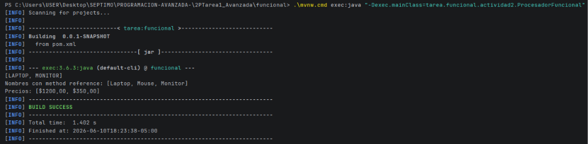
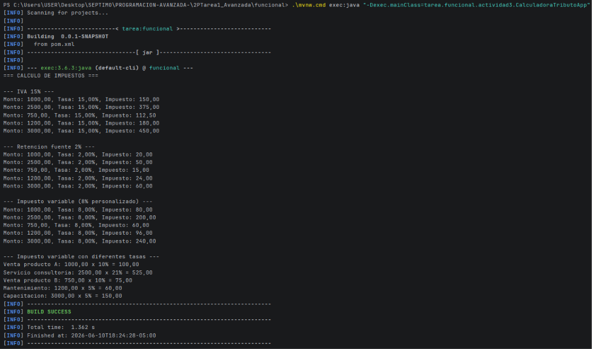
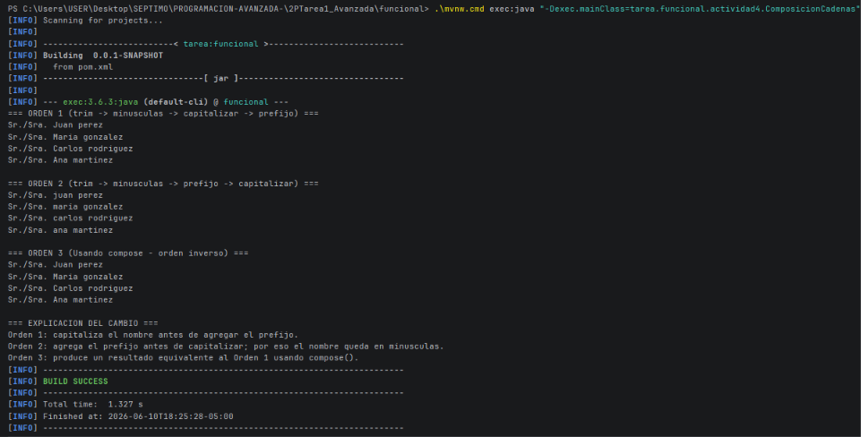

# Tarea de Programación Funcional en Java

## Requisitos
- Java 17
- Maven 3.6+

### Actividad 2: Procesador Funcional de Productos
...
* **Evidencia de ejecución:**
  

---

### Actividad 3: Calculadora de Tributos (Interfaz Funcional Personalizada)
...
* **Evidencia de ejecución:**
  

---

### Actividad 4: Composición de Cadenas y Funciones Pipeline
...
* **Evidencia de ejecución:**
  


## Compilar
```bash

mvn clean compile

